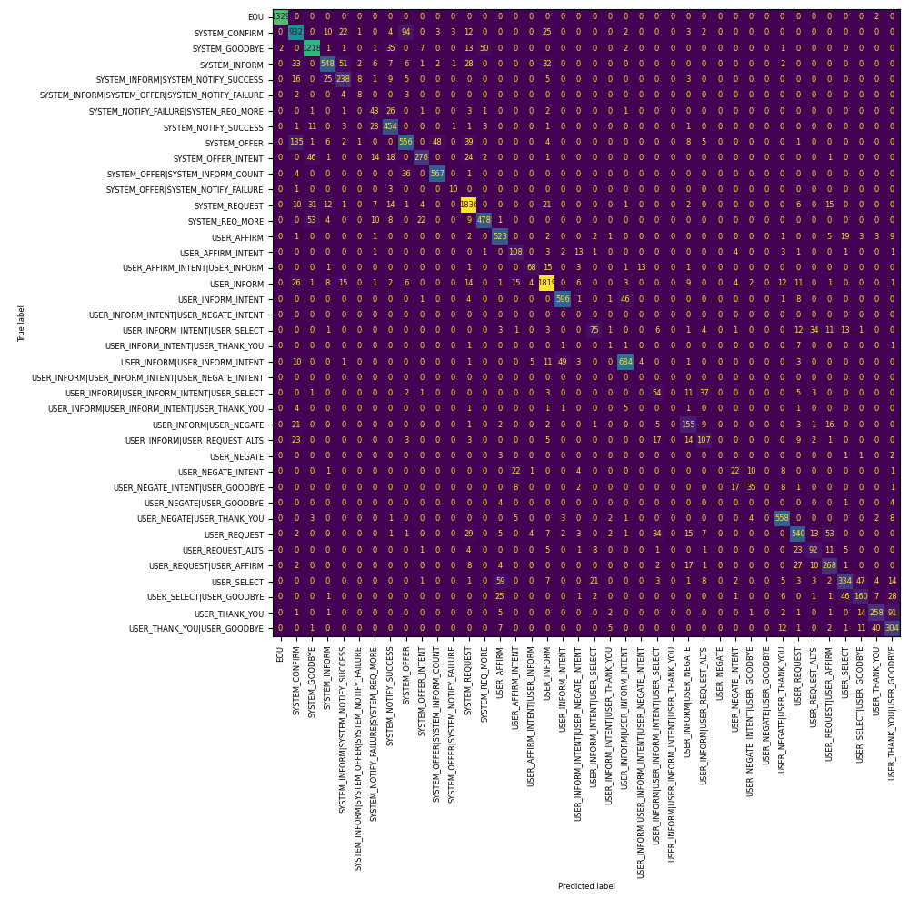
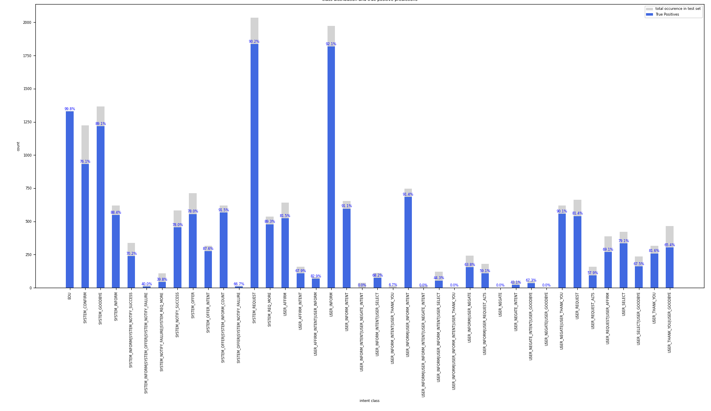
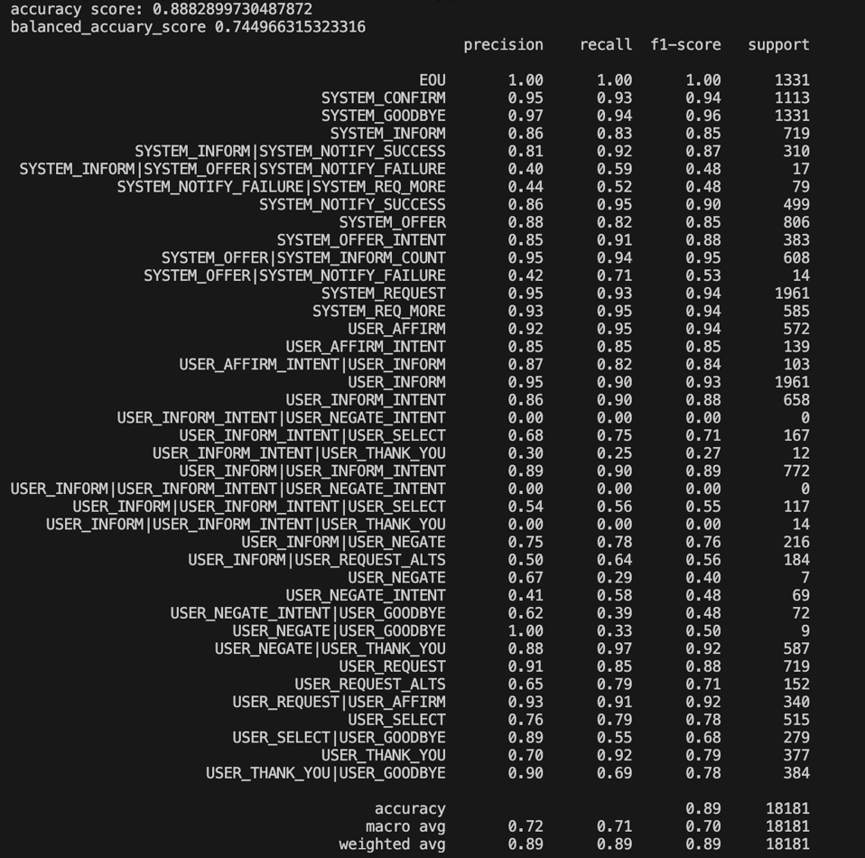

# Dialogue Act Classification with Context-Aware Self-Attention 
Implementation of a Dialogue Act Classifier with Context-Aware Self-Attention.

## Introduction
The code contained in this repo was created in the context of a project assignment for the course "Current Trends in Artificial Intelligence" at the Vrije Universiteit Brussel under supervision of Dr. Leticia Arco Garcia.
The goal of the project consisted of training a deep learning model that is able to predict dialogue acts in a conversation and test the implementation on a subset of the Schema-Guided Dialogue (SGD) dataset [[1]](#1) for which the training and test set can be found in the folder [data](data).
The [model architecture](model/context_aware_dac_model.py) is based on the work of Raheja & Tetreault [[2]](#2) and Chiu & Nichols [[3]](#3) and was inspired by [[4]](#4).  


## Prerequisites and installation
* The code is written in Python 3.9.6 and a [requirements.txt](requirements.txt) file, containing all required packages, is included in the repository. The implementation uses the [MLFlow](https://mlflow.org/) library to store the metrics and the trained models.
* Due to its size, the original Glove pretrained word vector file is not included in the repository. You can download the zipfile containing the word vector file from the [Stanford website](https://nlp.stanford.edu/data/glove.6B.zip). You should copy the *glove.6B.XXd.txt* file you want to use into the folder *model/glove/* and update the constants *GLOVE_FILE* and *GLOVE_TOKEN_SIZE* in the [model/context_aware_dac_model.py](model/context_aware_dac_model.py) file before using the codebase.


## Data preprocessing

The dataset used to train and evaluate the model is stored in the [data/train/TrainSet.json](data/train/TrainSet.json) and [data/test/TestSet.json](data/test/TestSet.json) folder and has the following statistics: 


| Indicators | Train | Test |
|-------------- | -------- | -------- |
| Total dialogues | 5403 | 1331 |
| Total utterances | 82588 | 16850 |
| Total domains | 14 | 17 |
|Total USER dialogue acts | 11 | 11 |
|Total SYSTEM dialogue acts | 10 | 10 |
|Average dialogues per domain | 385,92 | 78,29 |
| Average utterances per dialogue | 15,28 | 12,66 |


To speed up the code and in order to extract the dialogue act labels, a separate preprocessing script [load_data.py](data/load_data.py) is provided which extracts the relevant features and labels from the dataset and splits the training set into a training and validation set. Furthermore, each dialogue in all three sets is appended with a "EOU EOU" utterance (labelled: EOU), in order to help the model recognize the end of a dialogue. 
Finally, the preprocessing script saves this extracted data into [train.csv](data/train.csv), [validate.csv](data/validate.csv), [test.csv](data/test.csv) and [labels.csv](data/labels.csv). These files will then be used by the main scripts to train and test the data. 


## Training of the model

To train a new or existing model, one should use the script [train.py](train.py). This contains the function to run a complete training cycle and a main clause which can be used to set some parameters related to the training (e.g., batchsize, number of epochs, early_stopping,..). The code to train an existing model is commented out but can be used instead of the original code by providing the earlier saved MLFlow model name and version. If an existing run id for an MLFlow experiment is given, the training metrics will be added to this experiment.

## Evaluating the model

Evaluating the model can be accomplished by using the [evaluate.py](evaluate.py) script. As parameters, one should provide the earlier saved and trained *MLFlow* model name and version, which will then be loaded and evaluated using the test data as stored in [test.csv](data/test.csv). The script will calculate the accuracy, balanced accuracy, confusion matrix, and classification report.

## Using the model to classify the utterances of a specific dialogue

In order to use a trained model to predict a specific dialogue in the dataset, the [predict.py](predict.py) script can be used. The script requires a dataset, a specific dialogue id of the dialogue to classify (which must be in the dataset) and a *MLFlow* model name and version. As a result, the script will return the predicted dialogue acts together with the original dialogue data.

## Logging of metrics, parameters, and storing models
The codebase uses the [MLFlow](https://mlflow.org/) library to track the training results and store the trained models. During the first training run, mlflow will create a folder *mlruns* to store the results and models if no such folder already exists.
To consult the experiment parameters and metrics, the MLFLow web UI can be launched after the first training run by using the following command in the terminal:
  ```shell
  mlflow ui
  ```
  This will start a local webserver at [localhost:5000](http://localhost:5000) which allows for the consultation of all MLFlow registered info.

## Results
The implemented model in this repository was trained for 37 epochs on the training set resulting in the following metrics on the test set:
* accuracy score of 88.8%
* balanced accuracy score of 74.5%.

Further improvements are most likely possible by tuning the hyperparameters and model hidden layer sizes.


<br/><br/>
<!---

 -->

<br/><br/>


## References

<a id="1">[1]</a> 
[The Schema-Guided Dialogue Dataset](https://github.com/google-research-datasets/dstc8-schema-guided-dialogue)  from Rastogi, A., Zang, X., Sunkara, S., Gupta, R., Khaitan, P., 2020. [Towards scalable multi-domain conversational agents: The schema-guided dialogue dataset](https://ojs.aaai.org/index.php/AAAI/article/view/6394), in: Proc. AAAI Conf., pp. 8689–8696   
<a id="2">[2]</a> 
[Dialogue Act Classification with Context-Aware Self-Attention](https://aclanthology.org/N19-1373) (Raheja & Tetreault, NAACL 2019)  
<a id="3">[3]</a> 
[Named Entity Recognition with Bidirectional LSTM-CNNs](https://aclanthology.org/Q16-1026) (Chiu & Nichols, TACL 2016)  
<a id="4">[4]</a> 
[CASA-Dialogue-Act-Classifier](https://github.com/macabdul9/CASA-Dialogue-Act-Classifier) (Abdul macabdul9 2021)
